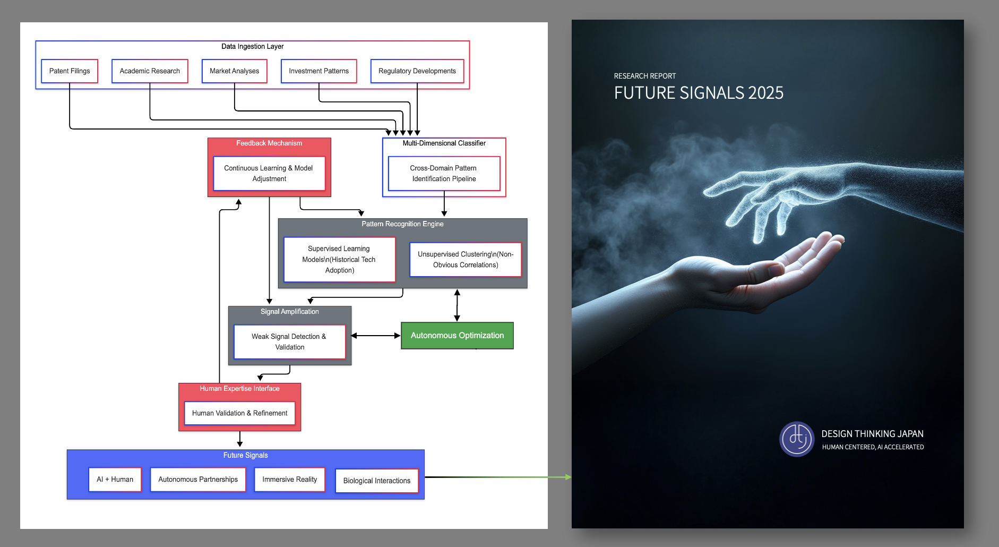

# Future Signals 2025: Strategic Technology Forecasting

This repository contains the "Future Signals 2025" research report by Design Thinking Japan - a strategic analysis of four transformative patterns reshaping the human-technology relationship.

## Key Findings: The Four Signals

- **AI + Human**: Collaborative intelligence amplifying human creativity and productivity
- **Autonomous Partnerships**: AI agents managing workflows with increasing independence  
- **Immersive Reality**: Blurring physical and digital boundaries for seamless experiences
- **Biological Interactions**: Natural interfaces responding to gestures, voice, and neural signals

Real-world impact examples: 60% faster creative production, 32% reduced hospital readmissions, 40% improvement in operational efficiency.

## Methodology: Synthesized Intelligence

It's not magic - it's methodology. The Design Thinking Japan team engineered a novel approach called **Synthesized Intelligence** specifically for this research.

Watching its technical implementation evolve was like falling down an exciting rabbit hole. Each iteration getting deeper as it kept discovering better and better patterns in the data.

### Core Architecture



The system processes multiple data streams simultaneously:
- Patent filings
- Academic research  
- Investment patterns
- Regulatory developments

All flowing through classification algorithms that identify cross-domain relationships. Traditional forecasting often falls short because it examines each domain in isolation, missing the connections that matter most.

### Pattern Detection Engine

The pattern detection engine required solving a critical challenge: distinguishing meaningful signal from market hype. Our approach combines:

- **Supervised learning** (trained on historical technology adoption data)
- **Unsupervised clustering** to detect non-obvious correlations across seemingly unrelated domains

### Human-AI Feedback Mechanism

The technical breakthrough came in the human-AI feedback mechanism. Instead of black-box recommendations, the system creates a collaborative interface where humans interrogate and refine identified patterns, continuously improving signal detection with each iteration.

### Results

What stood out was how this moves beyond theoretical AI to applied intelligence with verifiable results. Through this methodology, we identified the four fundamental patterns that provide a practical strategic compass for navigating today's complex technological landscape.

## Repository Contents

- **[Full Report PDF](Future_Signals_2025%2B2025%2B05%2B01%2BPublic%2BReport.pdf)** - Complete research findings and strategic analysis
- **[Architecture Diagram](methodology/future-signals-report-architecture-diagram.png)** - Visual representation of the Synthesized Intelligence system
- **[Methodology Folder](methodology/)** - Additional technical resources and documentation

## Citation

```
Design Thinking Japan (2025). Future Signals 2025: Strategic Technology Forecasting. 
Available at: https://github.com/DesignThinkingJapan/future-signals-2025-report
```

## License

This report is licensed under [Creative Commons Attribution 4.0 International License (CC BY 4.0)](https://creativecommons.org/licenses/by/4.0/). You are free to share, copy, distribute, and adapt the work for any purpose, even commercially, as long as you give appropriate credit to Design Thinking Japan.

## About Design Thinking Japan

Design Thinking Japan helps organizations find their fastest path from AI potential to measurable business outcomes.
We combine proven design thinking methodologies with 14+ years of enterprise AI implementation to create solutions that work for your people and your business.
Whether you're experimenting with AI, need quick wins to build momentum, or ready to scale existing initiatives - we meet you where you are and accelerate your journey forward.
From innovation labs to enterprise deployment, we've helped global leaders transform workflows that took days into minutes.

**Learn more**: [www.designthinkingjapan.com](https://www.designthinkingjapan.com)
