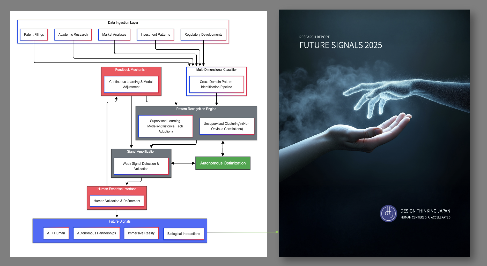

# Synthesized Intelligence: Technical Architecture for Future Signals Research

## Overview

The technical architecture behind the Future Signals 2025 research report represents a novel approach to technology forecasting. It's not magic - it's methodology. One the Design Thinking Japan team engineered specifically for this purpose.

## The System

It's called a **Synthesized Intelligence system**, and watching its technical implementation evolve was like falling down an exciting rabbit hole. Each iteration getting you deeper as it kept discovering better and better patterns in the data - genuinely exciting to witness!

## Core Architecture

The core architecture processes multiple data streams simultaneously:
- Patent filings
- Academic research
- Investment patterns
- Regulatory developments

All flowing through classification algorithms that identify cross-domain relationships. Traditional forecasting often falls short because it examines each domain in isolation, missing the connections that matter most.

## Pattern Detection Engine

The pattern detection engine required solving quite a challenge: distinguishing meaningful signal from market hype. The approach combines:

- **Supervised learning** (trained on historical technology adoption data)
- **Unsupervised clustering** to detect non-obvious correlations across seemingly unrelated domains

## Human-AI Feedback Mechanism

Then a practical technical breakthrough comes in the human-AI feedback mechanism. Instead of black-box recommendations, the system creates a collaborative interface where humans interrogate and refine the identified patterns, continuously improving signal detection with each iteration.

## Results

What stood out was how it moves beyond theoretical AI to applied intelligence with verifiable results. Through this methodology, DTJ identified four fundamental patterns reshaping the human-technology relationship:

1. **AI+Human** - Collaborative intelligence partnerships
2. **Autonomous Partnerships** - Independent AI agents operating at scale
3. **Immersive Reality** - Blended physical-digital environments
4. **Biological Interactions** - Natural interfaces responding to human biology

Together, they provide a practical strategic compass for navigating today's complex technological landscape.

## Technical Implementation



*The system architecture showing data flow from ingestion through pattern recognition to human validation and continuous learning loops.*

## About the Research

These explorations into practical applications of emerging tech always spark curiosity. The methodology demonstrates how human expertise and AI capabilities can be systematically combined to identify transformative technology patterns before they become obvious to everyone else.

**Full Report**: [Future Signals 2025](https://www.designthinkingjapan.com/)

---

**Credits**: Design Thinking Japan Team  
**Organization**: Design Thinking Japan - Human Centered, AI Accelerated  
**Leadership**: Brittany Arthur, Adalberto Gonzalez Ayala

## Citation

```
Design Thinking Japan (2025). Synthesized Intelligence: Technical Architecture for Future Signals Research. 
Available at: https://github.com/designthinkingjapan/future-signals-2025
```
